# Simple RSA 

> Based on [lorca](https://github.com/zserge/lorca). Requires Chrome/Edge (Chromium >= 70) to be installed. 

## 1. 程序使用说明

#### 1.1 图形界面

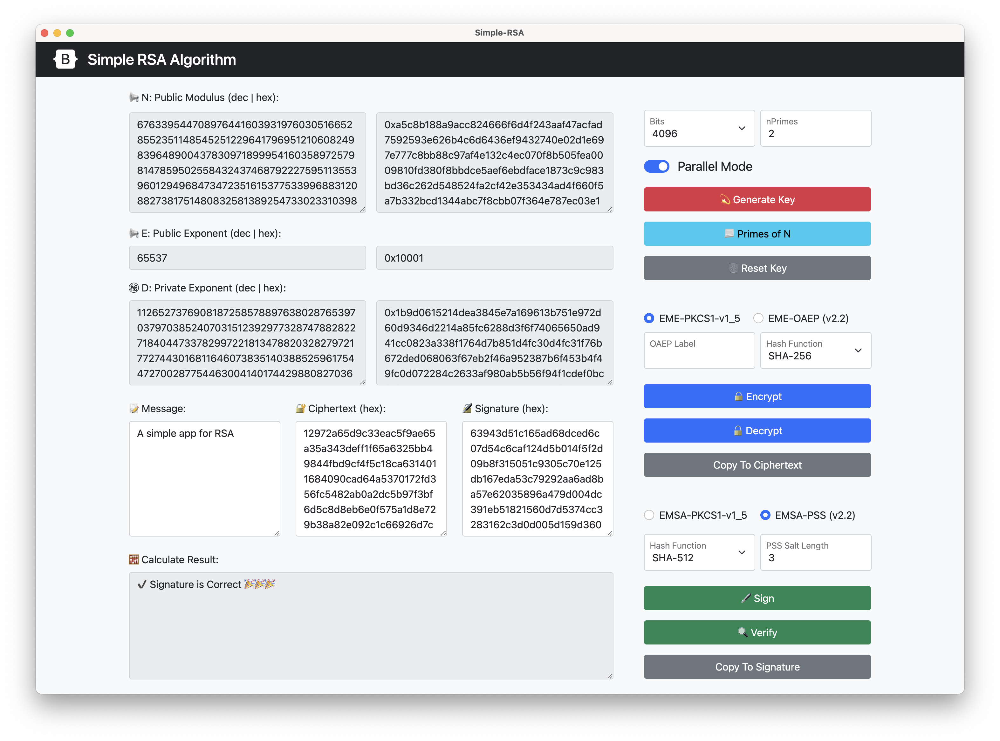

* 左侧为 RSA密钥、消息、密文、签名和计算结果的**展示及输入区域**
* 右侧为 RSA密钥生成，加密和解密，签名和验证的**选项及操作区域**

#### 1.2 功能介绍

##### 1.2.1 密钥生成

1. 指定**密钥位数**，如64、512、1024、2048、4096
2. 指定**素数个数**，必须大于2个， $ N = \prod{p_i}$
3. 显示生成的公钥 (N, E)、私钥 (D) 和组成私钥的素数

##### 1.2.2 加密与解密

1. 支持PKCS#1中两种标准 v1.5 和  v2.2 (OAEP) 的RSA 加密和解密
2. 选择 OAEP-Encode 模式时
   1. 支持指定 OAEP Label，可以为空
   2. 支持选择 Hash 函数

##### 1.2.3 签名和验证

1. 支持PKCS#1中两种标准 v1.5 和  v2.2 (PSS) 的RSA 签名和验证
2. 选择 PSS-Encode 模式时
   1. 支持选择 Hash 函数
   2. 支持指定 Salt 长度：0为自动选择；-1为同Hash函数大小相同

##### 1.2.4 输入与输出

​		可以在输入区中，输入 消息用来加密和签名；密文进行解密；签名进行验证

​		在计算结果区中，输出人性化提示，加密/解密结果，签名和验证结果

#### 1.3 使用说明及实例

##### 1.3.1 密钥生成

1. 配置密钥生成选项，多线程加速（默认为：2048位，2个质数的密钥）；
2. 点击生成按钮（在多线程下，1s以内生成4096位密钥）；
3. 显示生成的公钥（N, E）和私钥（D），左侧十进制，右侧为十六进制
4. 点击右侧 Primes按钮，可查看组成 N 的素数。可以切换素数进制表示

显示生成的密钥

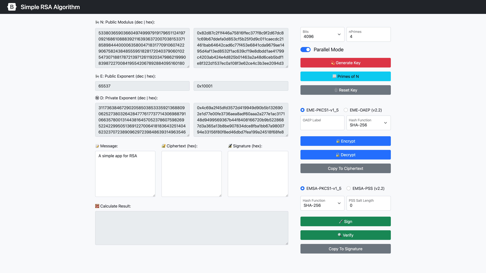

展示组成 N 的素数列表，可指定进制表示

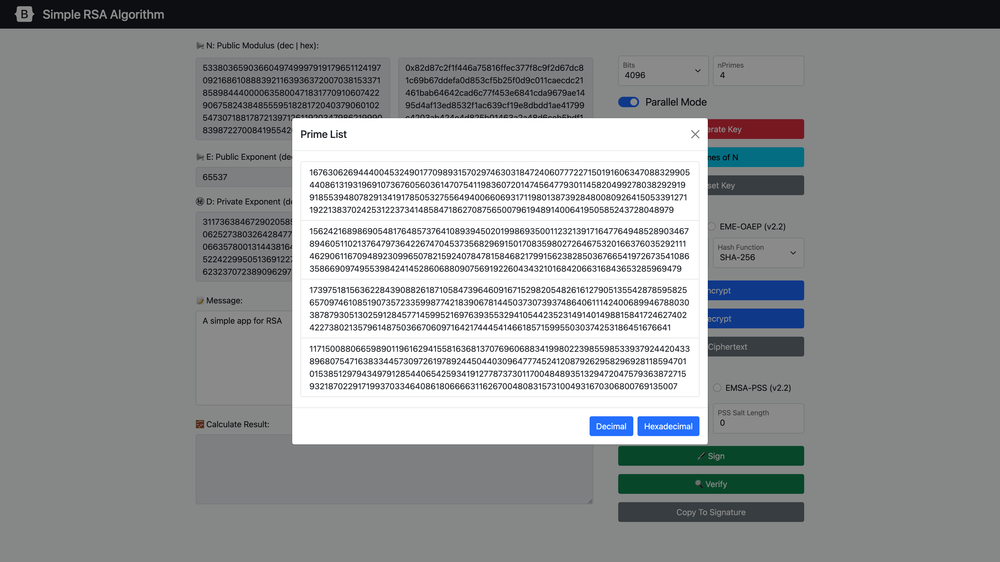

1.3.2 加密与解密

1. 在 Message 区域输入需要加密的信息/在 Ciphertext(hex) 输入需要解密的密文；
2. 配置选项：
   1. 选择【加密/解密】模式（编码方式）：v1.5 / v2.2  EME-OAEP
   2. 【v2.2  EME-OAEP】设置 OAEP-Label（默认为空）
   3. 【v2.2  EME-OAEP】选择 Hash 函数（默认为SHA-256）
3. 点击【Encrypt / Decrypt】按钮，结果显示在 Result 区域

EncryptOAEP: Null Label, SHA-256

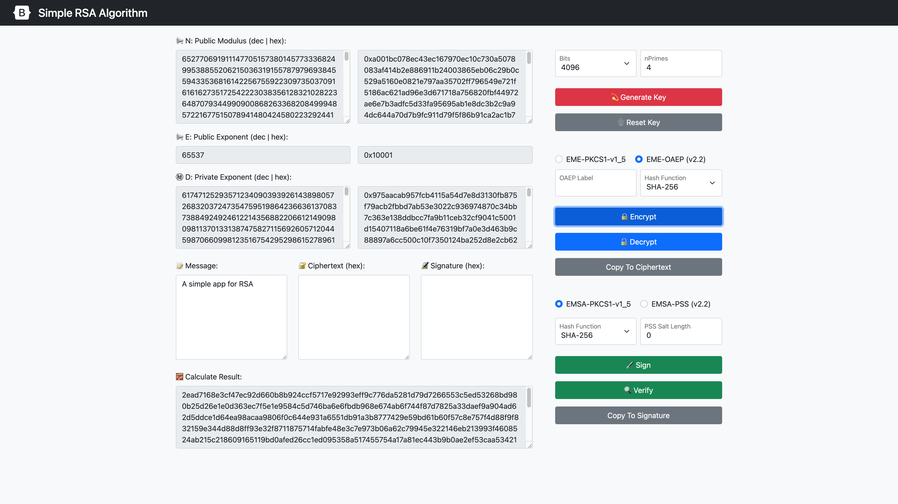

DecryptOAEP

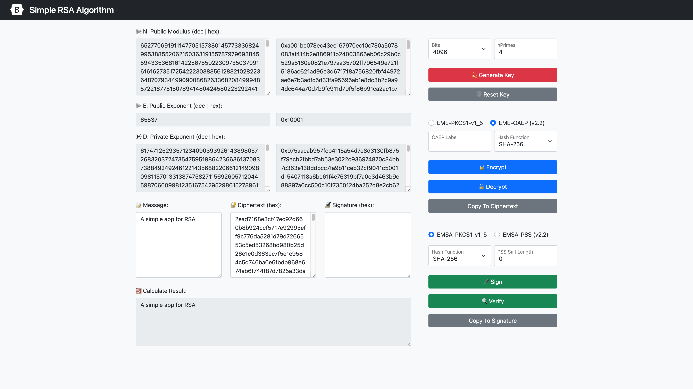

1.3.3 签名与验证

1. 在 Message 区域输入需要签名的信息/在 Signature(hex) 输入需要验证的签名；
2. 配置选项：
   1. 选择【签名/验证】模式（编码方式）：v1.5 / v2.2  EMSA-PSS
   2. 【v2.2  EMSA-PSS】选择 Hash 函数（默认为SHA-256）
   3. 【v2.2  EMSA-PSS】设置 Salt 长度（默认为 0，自动指定）
3. 点击【Sign / Verify】按钮，结果显示在 Result 区域

SignPSS: SHA-512, Auto Salt Length

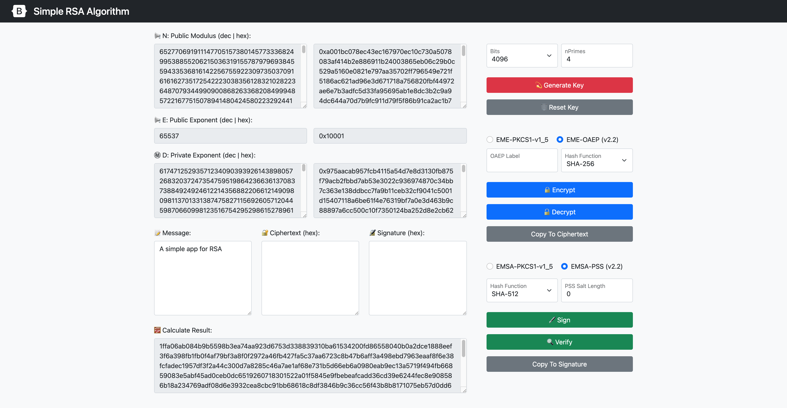

VerifyPSS

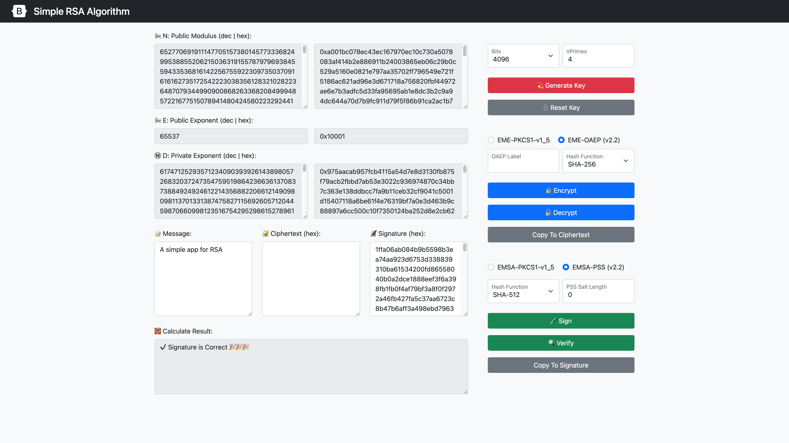

## 2. 算法/实现亮点

#### 2.1 性能评价

测试平台  Apple M1@ 3.2 GHz (8 cores) 8GB,  go1.17.2 darwin/arm64

##### 2.1.1 素数判定 

使用 Miller-Rabin 算法 探测 20 次，判断指定位数的素数

| Bits    | 128     | 512     | 1024    | 2048    |
| ------- | ------- | ------- | ------- | ------- |
| Time/Op | 0.15 ms | 1.99 ms | 9.40 ms | 59.5 ms |

##### 2.1.2 密钥生成

2个素数组成，指定密钥长度生成。2048位及以下小于 0.1s。

| Bits(2p) | 512     | 1024     | 2048         | 2048(3P) |
| -------- | ------- | -------- | ------------ | -------- |
| Time/Op  | 2.89 ms | 15.57 ms | **119.5 ms** | 57.13ms  |

**4096位密钥**：指定素数数量密钥生成。多线程加速后4096位小于1s

| Nprime   | 2             | 3           | 4       | 5       |
| -------- | ------------- | ----------- | ------- | ------- |
| Single   | 1,457.5ms     | 570.3ms     | 529.5ms | 441.4ms |
| Parallel | **596.57 ms** | **297.9ms** | 291.8ms | 392.2ms |

##### 2.1.3 RSA公钥 加密/验证

共同加密一个 4100bit 的数字

| BIts     | 512      | 1024     | 2048     | 4096      |
| -------- | -------- | -------- | -------- | --------- |
| Times/Op | 14.50 ms | 25.87 ms | 37.48 ms | 107.20 ms |

##### 2.1.4 RSA私钥 解密/签名

| P/MODE   | No-CRT       | 2-CRT         | 3-CRT         | 4-CRT         |
| -------- | ------------ | ------------- | ------------- | ------------- |
| 2048 bit | 2,699 ms/op  | 859.7 ms/op   | 430.3 ms/op   | 383.7 ms/op   |
| 4096 bit | 21,466 ms/op | 5,517.9 ms/op | 2,677.5 ms/op | 1,732.8 ms/op |

#### 2.2 算法/实现亮点

##### 2.2.1 底层运算

1. 乘法逆元：实现 扩展Euclidean 算法，利用其求解乘法逆元
2. 幂运算：实现快速幂算法，复杂度为 $O(\log_2{E})$ 次乘法运算 
3. 素数判定与生成：
   1. 实现 **指定位数**素数生成，实现 **Miller-Rabin** 算法快速判定素数
   2. 使用**多线程加速**素数的生成，使得在**1s内**生成**4096位**密钥

##### 2.2.2 RSA 元语

1. 公钥和私钥生成：实现了指定素数个数的密钥生成

   [RSA Private Key](https://datatracker.ietf.org/doc/html/rfc8017#section-3.2) 表示: 

   * `(p, q, dP, dQ, qInv)`
   * `(r_i, d_i, t_i), i = 3, ..., u`

2. 加密 [RSAEP](https://datatracker.ietf.org/doc/html/rfc8017#section-5.1.1) ：$c = m^e \bmod N$

3. 解密 [RSADP](https://datatracker.ietf.org/doc/html/rfc8017#section-5.1.2) $：m= c^d \bmod N$

   1. 利用 CRT 算法加速私钥解密

   2. 提供 Blinding（盲签名）选项：

      在计算 $m = c^d \pmod n$ 之前，令$c' = c*r^e$ 

      计算 $(c')^d = (c*r^e)^d = c^d*r^{ed} \equiv c^d*r \pmod n $

      $m = (c')^d * r^{-1} \equiv c^d * r * r^{-1} \equiv c^d \pmod n$

2.2.3 简洁友好的界面

响应布局、信息丰富；快速稳定、跨平台；交互友好，人性化提示。

2.2.4 完备的单元及性能测试

对实现的方法进行较为完整的单元测试；

对有性能要求的方法进行性能测试验证性能结果，部分结果详见 2.1 ；

此部分参考 golang 标准库 crypto/rsa@go1.17 中的测试文件。

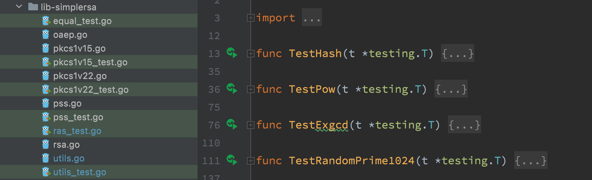

#### 2.3 符合 PKCS#1 标准 

[PKCS#1](https://en.wikipedia.org/wiki/PKCS_1) 是 [Public-Key Cryptography Standards (PKCS)](https://en.wikipedia.org/wiki/PKCS) 中的第一个标准。其中定义了几种 [Schemes](https://datatracker.ietf.org/doc/html/rfc8017#section-6): 将**密码原语**和其他技术相结合来实现特定的安全目标。

最新的版本为v2.2，广泛使用的版本是v1.5。现在应使用v2.2中定义的 Schemes，为了兼容性才考虑使用v1.5标准

##### 2.3.1 [PKCS#1 v1.5 (rfc2313)](https://datatracker.ietf.org/doc/html/rfc2313)

##### `EncyptPKCS1v15` & `DecryptPKCS1v15` 

实现了[ RSAES-PKCS1-v1_5](https://datatracker.ietf.org/doc/html/rfc8017#section-7.2)，使用 `EME-PKCS1-v1_5` 将消息 `M` 编码为 `EM`，对`EM`使用密码元语进行进一步操作

​			`EM = 0x00 || 0x02 || PS (random) || 0x00 || M`

##### `VerifyPKCSv15`  & `SignPKCSv15`

实现了 [RSASSA-PKCS1-v1_5](https://datatracker.ietf.org/doc/html/rfc8017#section-8.2) ，使用 `EMSA-PKCS1-v1_5` 编码

`EM = 0x00 || 0x01 || PS (0xff) || 0x00 || T (digestFuncID||digest)`

##### 2.3.2 [PKCS#2 v2.2 (rfc8017)](https://datatracker.ietf.org/doc/html/rfc8017)

与v1.5不同之处在于：

在加密和解密（`Encrypt` & `Decrypt`）实现了 [RSAES-OAEP](https://datatracker.ietf.org/doc/html/rfc8017#section-7.1)，使用了`EME-OAEP` 编码方式，使得能有效防范 CCA ([Chosen Ciphertext Attack](https://en.wikipedia.org/wiki/Chosen_ciphertext_attack)) 和 CPA，并达到以下两个目标：

* 将确定性（deterministic）加密方案（traditional RSA）转换为概率（probabilistic）方案
* 由于 OAEP 编码使用 trapdoor one-way permutation $f$ 来对明文进行编码，来确保攻击者无法恢复明文的任意部分，从而防止对密文的部分破解

在签名和验证（`Sign` & `Verify`）实现了 [RSASSA-PSS](https://datatracker.ietf.org/doc/html/rfc8017#section-8.1)，使用了 `EMSA-PSS` 编码方式，能够生成非确定性签名（`EMSA-PKCS1-v1_5` 是确定性的）

* 通过 `Salt` 可提供“tighter”的安全证明，来进一步提高安全性

##### `EncryptOAEP` & `DecryptOAEP`

RSAES-OAEP, **Optimal Asymmetric Encryption Padding** (**OAEP**)

* 加密时使用 `Hash`、 `MGF` 函数，对消息 `M` 和 可选的 `Label` 进行 `EME-OAEP` 编码，得到 `EM`，对 `EM` 使用 RSA加密元语进行加密；
* 解密时使用 RSA解密元语进行解密得到 `EM`，使用`Hash`、 `MGF` 函数和 `Label` 对其进行 `EME-OAEP` 解码，得到消息 `M`。 

`MFG` 是 Mask Generation Function。实现了基于Hash函数的 `MGF1(mgfSeed, maskLen, Hash)` 

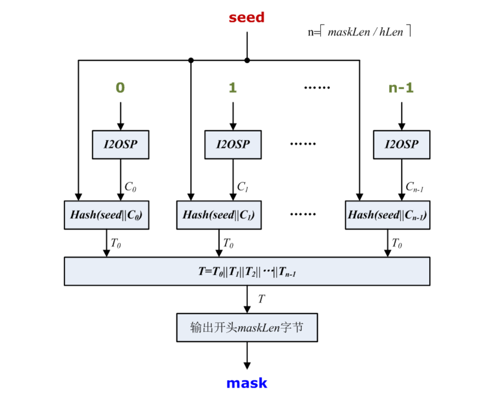

1. Check `maskLen` > 2^32
2. For `counter` from $0$ to $\lceil \mathrm{skLen} / \mathrm{hLen}\rceil -1$ do:
   1. Convert `counter` to 4 oct string: `C = I2OSP(counter, 4)`
   2. Concatenate: `T = T || Hash(mgfSeed || C)`
3. Output `T[maskLen:]`

`EME-OAEP` 编码结构及流程如下图所示：

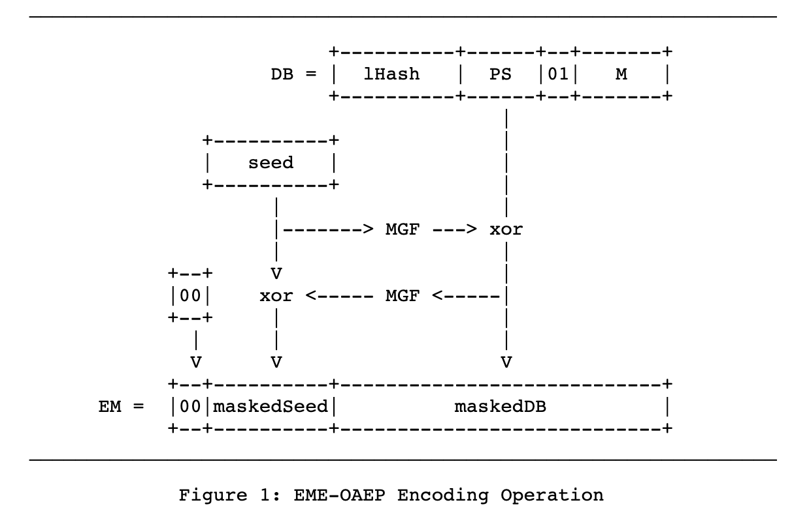

`EME-OAEP` 编码的配置选项有 `Hash`、`MGF` 和 `Label`

1. `lHash = Hash(Label)`
2. Generate zero padding string  `PS`, `Len(PS) = k - mLen - 2hLen - 2 `
3.  `DB = lHash || PS || 0x01 || M`, `len(DB) = k - hLen - 1`
4. Generate a random `seed`, `len(seed) = hLen`
5. `dbMask = MGF(seed, k - hLen - 1)`
6. `maskedDB = DB XOR dbMask`
7. `seedMask = MGF(maskedDB, hLen)`
8. `maskedSeed = seed XOR seedMask`
9. `EM = 0x00 || maskedSeed || maskedDB`

##### `SignPSS` & `VerifyPSS`

RSASSA-PSS, **Probabilistic Signature Scheme**

* 加密时使用 `Hash`、 `MGF` 函数，对消息 `M` 和 可选的 `Label` 进行 `EME-OAEP` 编码，得到 `EM`，对 `EM` 使用 RSA加密元语进行加密；
* 解密时使用 RSA解密元语进行解密得到 `EM`，使用`Hash`、 `MGF` 函数和 `Label` 对其进行 `EME-OAEP` 解码，得到消息 `M`。 

[`EMSA-PSS` 编码](https://datatracker.ietf.org/doc/html/rfc8017#section-9.1)结构及流程如下图所示：

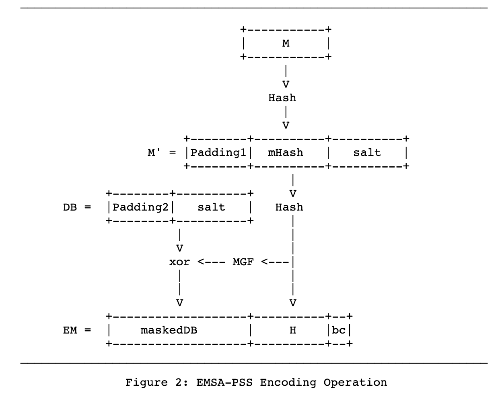

`EMSA-PSS` 编码的配置选项有 `Hash`、`MGF` 和 `Salt`的长度 `sLen`

1. `mHash = Hsah(M)`
2. Check `emLen >= hLen + sLen + 2`
3. Generate random `salt`, `Len(salt)=sLen`
4. `M' = (0x)00 00 00 00 00 00 00 00 || mHash || salt`
5. `H = Hash(M')`
6. Generate zero string `PS`, `Len(PS) = emLen - sLen - hLen - 2`
7. `DB = PS || 0x01 || salt`, `Len(DB) = emLen - hLen - 1`
8. `dbMask = MGF(H, emLen - hLen - 1)`
9. `maskedDB = DB \xor dbMask`
10. Set leftmost `8emLen - emBits` bits of `maskedDB[0]` to zero
11. `EM = maskedDB || H || 0xbc`
